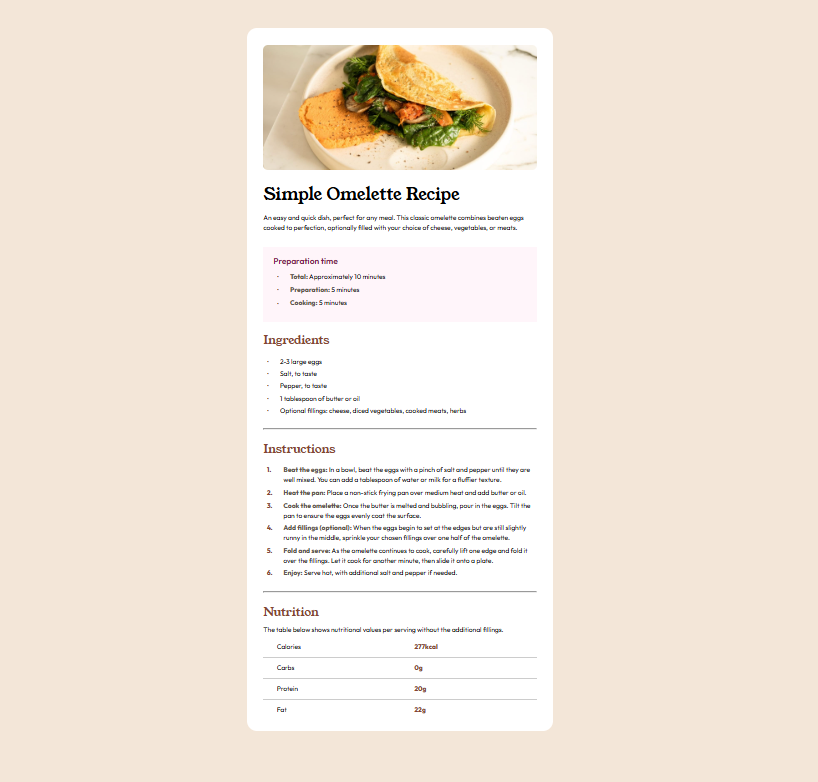

# Frontend Mentor - Recipe page solution

This is a solution to the [Recipe page challenge on Frontend Mentor](https://www.frontendmentor.io/challenges/recipe-page-KiTsR8QQKm). Frontend Mentor challenges help you improve your coding skills by building realistic projects. 

## Table of contents

- [Overview](#overview)
  - [The challenge](#the-challenge)
- [My process](#my-process)
  - [Built with](#built-with)
  - [What I learned](#what-i-learned)

**Note: Delete this note and update the table of contents based on what sections you keep.**

## Overview

### The Challenge

Result




## My process

### Built with

- Semantic HTML5 markup
- CSS custom properties
- Flexbox
- CSS Grid


### What I learned

Use of pseudo element `::before` to achive the provided style of the lists markers. The list item `li` markers has their own behaviour, to override that and make the list item to debahve like a flex box I did the following

```css
ul {
  list-style: none; /* remove default bullets */
}

ul li {
    display: flex; /* make each list item a flex container */
    align-items: center; /* vertically center the bullet and text */
    ...
}

ul li::before {
    content: "•"; /* add a bullet point */
    font-size: 16px; /* set bullet size */
    width: 16px; /* fixed width for the bullet */
    ...
}
```

A similar approach for ordered lists.