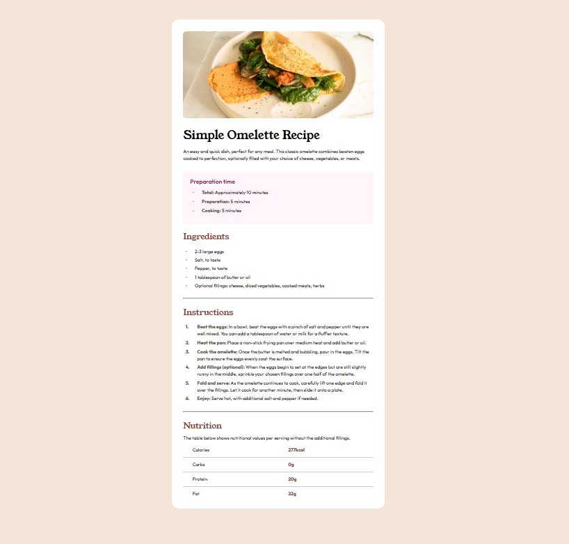

# Frontend Mentor - Recipe page solution

This is a solution to the [Recipe page challenge on Frontend Mentor](https://www.frontendmentor.io/challenges/recipe-page-KiTsR8QQKm). Frontend Mentor challenges help you improve your coding skills by building realistic projects. 

## Table of contents

- [Overview](#overview)
  - [The challenge](#the-challenge)
- [My process](#my-process)
  - [Built with](#built-with)
  - [What I learned](#what-i-learned)

**Note: Delete this note and update the table of contents based on what sections you keep.**

## Overview

### The Challenge

Result




## My process

### Built with

- Semantic HTML5 markup
- CSS custom properties
- Flexbox


### What I learned

#### HTML Semantics: Use semantic elements correctly
- Heading hierarchy must be sequential: `h1 → h2 → h3`. Skipping levels (e.g. using `h3` without a preceding `h2`) breaks the document outline for screen readers.

#### HTML Semantics: Table accessibility
- Always add a `<caption>` to tables — it is the semantically correct way to label a table and what screen readers announce first.
- A `<p>` before the table does not associate programmatically with it.
```html
<table>
  <caption class="table-caption">Nutritional values per serving without additional fillings.</caption>
  <tbody>...</tbody>
</table>
```
#### HTML Semantics: List item wrappers
- In a flex-based list (`li { display: flex }`) the text content needs a single wrapper element so it behaves as one flex child — otherwise `<span>` and text nodes become separate flex items and break layout.
- Use `<p>` instead of `<div>` for paragraph-like content:

```html
<!-- correct -->
<li><p><span class="label-text">Beat the eggs:</span> In a bowl...</p></li>

<!-- avoid -->
<li><div class="list-item-content"><span>...</span> text</div></li>
```

#### HTML Semantics: `<hr>` role
- Add `role="none"` to decorative `<hr>` elements to remove them from the accessibility tree:

```html
<hr role="none">
```

#### CSS Architecture: Avoid global selectors for scoped intent
- `ul li::before` targeting all lists caused the ordered list in instructions to inherit bullet styles alongside counters.
- Scope list styles to specific components:

```css
/* avoid */
ul li::before { content: "•"; }

/* prefer */
.recipe-list li::before { content: "•"; }
```
#### CSS Design Tokens: Hardcoded colors break the token system
- Replace any raw color values with tokens: `border-bottom: 1px solid #ccc` → `border-bottom: 1px solid var(--stone-150)`.


#### Accesibility: `prefers-reduced-motion`
- Any CSS transition or animation should be opt-in for users who have flagged motion sensitivity:

```css
/* motion off by default */
.recipe-card__img { /* no transition */ }

/* opt in only if user has no preference */
@media (prefers-reduced-motion: no-preference) {
    .recipe-card__img {
        transition: width 0.3s ease;
    }
}
```

#### Accesibility: Font smoothing
- `-webkit-font-smoothing: antialiased` only applies to WebKit. Add the Firefox equivalent:

```css
body {
    -webkit-font-smoothing: antialiased;
    -moz-osx-font-smoothing: grayscale;
}
```

#### Accesibility: `overflow-wrap` on body
- Prevents long words or URLs from breaking layouts on narrow viewports:

```css
body {
    overflow-wrap: break-word;
}
```

#### Tables: `border-collapse` vs `border-spacing`
- These two properties are mutually exclusive. `border-spacing` is ignored when `border-collapse: collapse` is set. Never use both together:

```css
/* correct */
table {
    border-collapse: collapse;
    width: 100%; /* always set explicitly */
}
```

#### Tables: Tables have no default width
- A `<table>` sizes itself to fit its content by default (shrink-wrap behavior).
- Always set `width: 100%` to fill the container.

#### Tables: Tables in flex containers
- A `<table>` inside a flex container stretches to fill it via `align-items: stretch`.
- This works but is accidental — set `width: 100%` explicitly so sizing doesn't depend on the parent's layout mode.

#### Tables: `th` is bold by default
- The CSS reset strips `font-weight` from `h1–h6` but not from `th`. Add explicitly:

```css
.nutrition th {
    font-weight: 400;
}
```

#### Tables: First and last row padding balance
```css
/* remove top padding from first row for visual balance */
.nutrition tr:first-child :is(th, td) {
    padding-top: 0;
}

/* remove border and bottom padding from last row */
.nutrition tr:last-child :is(th, td) {
    border-bottom: none;
    padding-bottom: 0;
}
```

#### Tables: Use `:is()` to reduce selector repetition
```css
/* verbose */
.nutrition tr:last-child th,
.nutrition tr:last-child td { ... }

/* concise */
.nutrition tr:last-child :is(th, td) { ... }
```

#### Images: Never combine `height` and `aspect-ratio`
- An explicit `height` overrides the aspect-ratio calculation. Use one or the other:

```css
/* correct — let aspect-ratio control height */
.recipe-card__img {
    width: 100%;
    aspect-ratio: 1312 / 600;
    object-fit: cover;
}
```

#### Images: Always include `object-fit: cover` when setting a fixed height
- Without it, images distort when the natural dimensions don't match the container:

```css
.recipe-card__img {
    height: 171px;
    width: 100%;
    object-fit: cover; /* required */
}
```

#### Responsive Design: Mobile-first means base styles = mobile
- Write base styles for the smallest viewport. Add complexity with `min-width` media queries.
- `max-width` queries layer styles in reverse and are harder to maintain.


#### Responsive Design: Use `max-width` + `width: 100%` for fluid cards
```css
.recipe-card {
    width: 100%;       /* fills viewport on small screens */
    max-width: 736px;  /* caps at design width on large screens */
}
```

#### Responsive Design: The gap appears naturally — no explicit padding needed
- With `display: flex; justify-content: center` on the parent and `max-width` on the card, the gap between card and viewport edges grows automatically as the viewport exceeds the `max-width`. No manual padding calculation required.


#### Responsive Design: `clamp(min, preferred, max)` for smooth transitions
- Eliminates hard breakpoint jumps for properties like padding, font-size, border-radius, and gap.
- Syntax: `clamp(minimum, fluid-value, maximum)`


#### Responsive Design: Deriving the fluid formula between two breakpoints
To transition a value from `A` at viewport `Vmin` to `B` at viewport `Vmax`:

```
slope     = (B - A) / (Vmax - Vmin)
intercept = A - slope * Vmin

result = clamp(A, slope * 100vw + intercept, B)
```

Example — card padding from `0px` at `375px` to `40px` at `765px`:
```
slope     = (40 - 0) / (765 - 375) = 40 / 390 ≈ 0.1026
intercept = 0 - 0.1026 * 375 = -38.46px

padding: clamp(0px, 10.26vw - 38.46px, 40px);
```

#### Responsive Design: Inverse clamp for compensating properties
- When the card gains padding at tablet, the inner content padding should shrink to zero — use a negative slope:

```css
/* card padding grows: 0 → 40px */
padding: clamp(0px, 10.26vw - 38.46px, 40px);

/* content padding shrinks: 40px → 0 */
padding-block: clamp(0px, -10.26vw + 78.46px, 40px);
```

#### Responsive Design: Always comment clamp formulas
- The raw numbers are unreadable. Document the intent:

```css
/*
  Fluid scaling anchors:
  min value at 375px viewport → max value at 765px viewport
*/
padding: clamp(0px, 10.26vw - 38.46px, 40px);
```

#### Responsive Design: `height: auto` not `height: 100%` when clearing a base height
- At mobile an image may have a fixed height (e.g. `171px`). In the desktop media query, override with `height: auto` — not `height: 100%` — so `aspect-ratio` takes control:

```css
/* mobile base */
.recipe-card__img { height: 171px; }

/* desktop override */
@media (min-width: 768px) {
    .recipe-card__img {
        height: auto;           /* clears the 171px */
        aspect-ratio: 1312 / 600;
    }
}
```

#### Media queries: Media query order is load-bearing
- When two `min-width` queries both match (e.g. viewport is 800px and you have both `min-width: 375px` and `min-width: 736px`), **the last one in source order wins**.
- Always write breakpoints from smallest to largest:

```css
@media (min-width: 375px) { ... } /* first */
@media (min-width: 768px) { ... } /* second — wins at 768px+ */
```


#### Media queries: Choose breakpoints based on content, not just device sizes
- The tablet breakpoint should be wide enough that the card layout with its padding actually fits. If `max-width: 736px` with `48px` side padding, the viewport must be at least `736 + 96 = 832px` before the full card is visible. A breakpoint of `1024px` is safer than `736px`.


#### Custom List Markers with `::before`

Browser default list markers (disc, decimal) are not part of the normal flow — they sit outside the list item box and cannot be controlled with flexbox. To gain full control over marker alignment and styling, replace them with a ::before pseudo-element.

```css
/* 1. Remove the native marker */
.recipe-card__list {
  list-style: none;
  padding-left: 0;
}

/* 2. Make li a flex container */
.recipe-card__list li {
  display: flex;
  align-items: center;
  /* other properties ...*/
}

/* 3. Inject the marker as a flex item */
.recipe-card__list li::before {
  content: "•";
  /* other properties */
  flex-shrink: 0;
}
```

The same approach for ordered lists, replacing the native counter with a CSS one:


```css
.instructions ol {
  list-style: none; /* remove default numbers */
  counter-reset: item; /* start custom counter */
  padding-left: 0;
}

.instructions ol li {
  display: flex;              /* put number + text in a row */
  align-items: flex-start;    /* align nicely at the top */
  counter-increment: item;    /* increment counter */
}

.instructions ol li::before {
  content: counter(item) ".";  /* generate number */
  margin-right: var(--space-4);         /* space between number and text */
  min-width: var(--space-6);            /* keeps numbers aligned */
}
```

Why this works:

- `list-style: none` removes the native marker so it does not double up with `::before`.
- `display: flex` on li turns the pseudo-element and the text wrapper into two side-by-side flex items.
- `align-items: center` vertically centers the marker relative to the entire text block — so when content wraps to multiple lines the marker sits in the middle, matching the Figma design intent.
- `align-items: flex-start` on ordered list items pins the number to the top of the first line, which reads more naturally for multi-line instructions.
- `flex-shrink: 0` and a fixed `width`/`min-width` on the pseudo-element prevent it from compressing when text is long.
- The text content must be wrapped in a `<p>` inside the `<li>` — without it, the text and any inner `<span>` become separate flex items and the layout breaks.


**Notes:**


- Duplicate `<link rel="preconnect">` tags waste a network request — one pair is enough.
- Remove unused font imports — each unused font family is a wasted request.